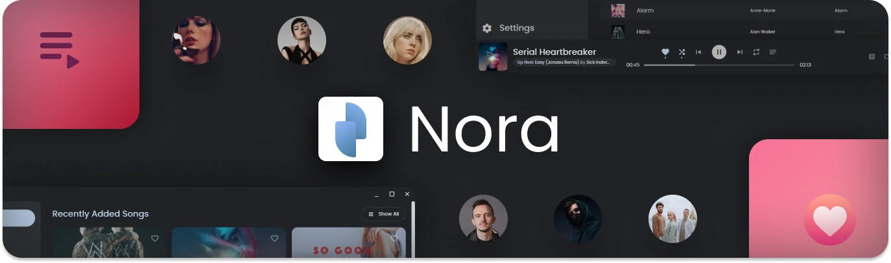

 <h1 align="center">
   
   <!-- <p>Nora Player</p> -->
 </h1>

 <div align="center">
  
  
  
  <a href="https://github.com/Sandakan/Nora/blob/master/LICENSE"></a>
  <a href="https://github.com/Sandakan/Nora/issues"></a>
  
 </div>

 <br/>

<div align="center">
Nora is an elegant music player built using Electron and React. 
<br>
Inspired from <a href="https://play.google.com/store/apps/details?id=com.piyush.music&gl=us">Oto Music (Android)</a> by Piyush Mamidwar.
</div>

<br/>

<div align="center">
  <a href="#app-features">Features</a> &bull;
  <a href="#build-this-project-on-your-system">Build on your system</a> &bull;
  <a href="#user-feedback">User feedback</a> &bull;
  <a href="/changelog.md">Changelog</a> &bull;
  <a href="https://github.com/Sandakan/Nora/releases">Download</a>
</div>

<br/>


<br/>

With simplicity and design in mind, this app was made to overcome problems when using default music apps on platforms that lack essential features.

<br>

## App features

It packs a horizon of features including,

- Organize your songs, artists, albums, and playlists with ease.
- Create playlists that meet your needs.
- Sing along with song lyrics[^1].
- Support for synced lyrics.
- Keep your favorite songs and artists close to you.
- Read your favorite artist's biography.
- Personalized music shuffling[^2].(Upcoming)
- Change between Light and Dark themes with ease.
- A mini-player to help focus on what matters at the moment.
- Edit the metadata of your songs easily and conveniently [^3].
- Search through your library with the help of song filters.

<br>


Visit the [release notes](/changelog.md) to see what's new on the latest release.</p>

<br>


<br/>

## User Feedback

<br>

<div align="center"> 
  <div>
    <h3><i>" A sleek music player with a modern design, this solution seeks to provide users with a seamless experience when it comes to listening to their favorite local tunes. "</i></h3>
    <a href="https://www.softpedia.com/get/Multimedia/Audio/Audio-Players/Oto-Music-for-Desktop.shtml"><i>Robert Condorache &bull; Softpedia </i></a>
  </div> 
</div>

<br>

<div align="center"> &bull; &bull; &bull; </div>

<br>

<div align="center"> 
  <div>
    <h3><i>" The application interface adopts rounded corners in a large area, the fonts and icons are round and cute, and the visual effect is very comfortable. "</i></h3>
    <a href="https://sspai.com/post/78669"><i>Apps Worth Watching in the Near Future &bull; SSPAI</i></a>
  </div> 
</div>

<br>

<div align="center"> &bull; &bull; &bull; </div>

<br>

<div align="center"> 
  <div>
    <h3><i>" Just found the most beautiful music player for Windows: Nora "</i></h3>
    <a href="https://www.reddit.com/r/windowsapps/comments/11xgg99/just_found_the_most_beautiful_music_player_for/"><i>r/windowapps &bull; Reddit</i></a>
  </div> 
</div>

<br><br>

## Build this project on your system

<br/>

Clone the project

```bash
  git clone https://github.com/Sandakan/Nora
```

Go to the project's folder

```bash
  cd Nora
```

Install dependencies

```bash
  npm install
```

Run

```bash
  npm start
```

<br>

This project is built using [Electron React Boilerplate](https://github.com/electron-react-boilerplate/electron-react-boilerplate).

<br>

## Star History

[](https://star-history.com/#Sandakan/Nora&Date)

## Feedback

If you have any feedback about bugs, feature requests, etc. about the app, please let me know through the official [Nora Discord server](https://discord.gg/c5rGKnBs4y), or my [email](mailto:sandakannipunajith@gmail.com).

<br>

 <center>
     Made with <span class="heart">&#10084;</span> by Sandakan Nipunajith.
    <br>
    Love, Sri Lanka.
 </center>

<br>

- ##### Every song, artist, album, and song cover used in this demonstration is not owned by myself but owned by their respective owners. They were used for demonstration purposes only. I value all the copyrights of the owners of the above assets.

[^1]: The song lyrics use the [SongLyrics](https://www.npmjs.com/package/songlyrics) package and an implementation from the [MxLRC](https://github.com/fashni/MxLRC) package under the hood.
[^2]: Personalized shuffles and playlists are generated by analyzing the user's listening patterns and the number of times each song gets played.
[^3]: Currently, the app only supports editing mp3 files due to some limitations of the dependencies.
