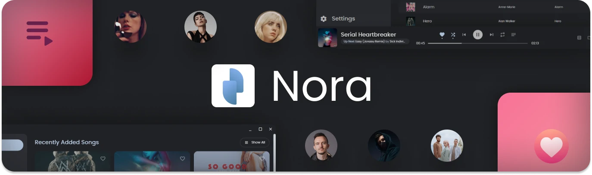

<div align="center">



# Nora Player

### An elegant music player for the modern desktop

Built with Electron and React • Inspired by [Oto Music](https://play.google.com/store/apps/details?id=com.piyush.music&gl=us)


[](https://github.com/Sandakan/Nora/blob/master/LICENSE)
[](https://github.com/Sandakan/Nora/issues)


[](https://crowdin.com/project/nora)

[Download](https://github.com/Sandakan/Nora/releases/latest) • [Features](#-features) • [Build Guide](#-build-from-source) • [Changelog](/changelog.md) • [Discord](https://discord.gg/c5rGKnBs4y)

</div>

---

## 🎯 Why Nora?

Nora reimagines desktop music playback with thoughtful design and powerful features. Built to overcome the limitations of default music apps, it provides an intuitive and beautiful experience that puts your music front and center.


## ✨ Features

**Library Management**

- ✅ Organize songs, artists, albums, and playlists with ease
- ✅ Advanced search with smart song filters
- ✅ Edit song metadata easily and conveniently[^3]

**Listening Experience**

- ✅ Sing along with song lyrics[^1]
- ✅ Support for synced lyrics
- ✅ Last.FM scrobbling integration
- ✅ Mini-player mode for distraction-free listening

**Personalization**

- ✅ Keep favorite songs and artists close to you
- ✅ Read your favorite artist's biography
- ✅ Create playlists that meet your needs
- ⏳ Personalized music shuffling[^2] (Upcoming)

**Customization**

- ✅ Switch between Light and Dark themes with ease


Check out the [changelog](/changelog.md) to see what's new in the latest release.

## 📥 Download

Go to the **[Releases page](https://github.com/Sandakan/Nora/releases) > Assets > Choose your platform** or [download the latest version directly](https://github.com/Sandakan/Nora/releases/latest).

## 📸 Gallery


## 💬 What People Say

<div align="center">

> _"A sleek music player with a modern design, this solution seeks to provide users with a seamless experience when it comes to listening to their favorite local tunes."_  
> — Robert Condorache, [Softpedia](https://www.softpedia.com/get/Multimedia/Audio/Audio-Players/Oto-Music-for-Desktop.shtml)

---

> _"The application interface adopts rounded corners in a large area, the fonts and icons are round and cute, and the visual effect is very comfortable."_  
> — [Apps Worth Watching in the Near Future • SSPAI](https://sspai.com/post/78669)

---

> _"Just found the most beautiful music player for Windows: Nora"_  
> — [r/windowsapps • Reddit](https://www.reddit.com/r/windowsapps/comments/11xgg99/just_found_the_most_beautiful_music_player_for/)

</div>

## 🛠 Build From Source

Clone the repository

```bash
git clone https://github.com/Sandakan/Nora
```

Navigate to project folder

```bash
cd Nora
```

Install dependencies

```bash
npm install
```

Launch in development mode

```bash
npm start
```

## 📊 Star History

[](https://star-history.com/#Sandakan/Nora&Date)

## 🤝 Feedback & Contributing

Have feedback, bug reports, or feature requests? Reach out through:

- [Discord Server](https://discord.gg/c5rGKnBs4y)
- [Email](mailto:sandakannipunajith@gmail.com)
- [GitHub Issues](https://github.com/Sandakan/Nora/issues)

Help translate Nora on [Crowdin](https://crowdin.com/project/nora)!

---

<div align="center">

Made with ❤️ by Sandakan Nipunajith  
Love, Sri Lanka

_All songs, artists, albums, and cover art used in demonstrations are property of their respective owners and used for illustrative purposes only. All copyrights are respected._

</div>

---

[^1]: Song lyrics use the [SongLyrics](https://www.npmjs.com/package/songlyrics) package and an implementation from the [MxLRC](https://github.com/fashni/MxLRC) package.

[^2]: Personalized shuffles and playlists are generated by analyzing listening patterns and play counts.

[^3]: Currently, the app only supports editing MP3 files due to dependency limitations.
